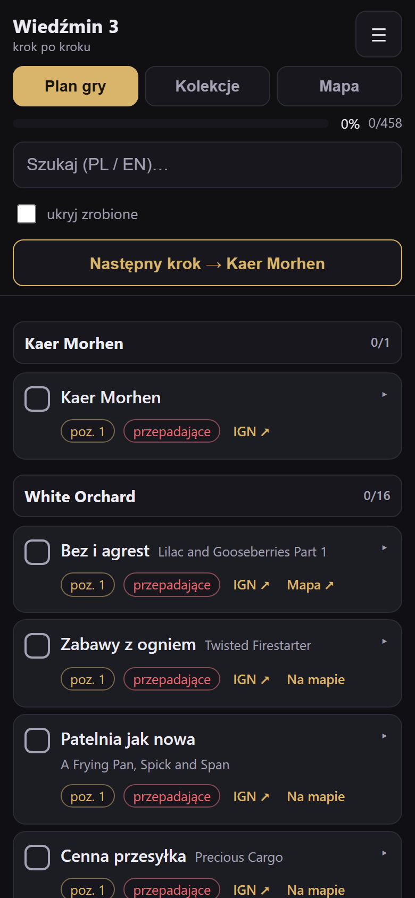

# Wiedźmin 3 — krok po kroku

Mobilna checklista do Wiedźmina 3: Wild Hunt (baza + **Serca z Kamienia** +
**Krew i Wino**), która prowadzi Cię przez grę w optymalnej kolejności i pozwala
odhaczać postęp — żeby niczego nie pominąć.

- **Plan gry** — 458 kroków (questy, kontrakty, wyścigi, walki na pięści,
  skarby…), pogrupowane w rozdziały regionów, z sugerowanym poziomem
  i wskazówkami z arkusza „optimal order".
- **Kolekcje** — 710 pozycji w 12 kategoriach IGN: karty do gwinta, miejsca
  mocy, diagramy sprzętu, bossowie, romanse i inne. Do robienia w dowolnym
  momencie.
- Każda pozycja ma link do **IGN** po szczegóły.
- **Mapa** (zakładka) — interaktywna mapa regionów z naszymi znacznikami
  (miejsca mocy, kontrakty, karty Gwent, sprzęt…). Znacznik pokazuje nazwę
  PL/EN, pozwala odhaczyć pozycję i przejść do IGN. Przy pozycjach jest też
  link **„Na mapie"** (w apce) albo **„Mapa ↗"** (do mapy IGN).
- Nazwy: **polskie + angielskie** (polskie z wiki Fandom, gdzie udało się
  zmapować; inaczej tylko angielska).

Wynik to jeden plik `index.html` — bez zależności, działa offline.



## Jak używać na telefonie

1. Otwórz `index.html` w przeglądarce (albo opublikuj go — patrz niżej).
2. Przechodź kroki po kolei i odhaczaj. Przycisk **„Następny krok →"** zawsze
   przenosi do pierwszego nieodhaczonego zadania.
3. **„ukryj zrobione"** daje czystą listę tego, co zostało; **szukajka**
   działa po nazwach PL i EN.
4. Kroki, które mają wskazówki, rozwijasz klikając w ich **tytuł** (spoiler
   pokazuje się tylko dla tego jednego zadania).
5. Krok oznaczony jako **„przepadające"** (czerwony chip) można nieodwracalnie
   przegapić — zrób go, zanim zniknie.
6. Postęp zapisuje się automatycznie w przeglądarce.

### Mapa

- Zakładka **Mapa** pokazuje 7 regionów z 409 znacznikami dopasowanymi do
  pozycji z listy. Kafelki pobierane są **online** z serwera MapGenie, więc
  mapa wymaga internetu — reszta aplikacji (i postęp) działa offline.
- Gdy nie ma sieci, użyj linku **„Mapa ↗"**, który otwiera mapę IGN w przeglądarce.
- Dane i grafika mapy należą do **MapGenie** (udostępniane przez IGN); aplikacja
  tylko je wyświetla i nie hostuje.

### Zapis i przenoszenie postępu

W menu (☰):

- **Eksportuj (JSON)** / **Importuj** — kopia postępu; przenieś ją na inne
  urządzenie lub zabezpiecz przed wyczyszczeniem danych przeglądarki.
- **Kopiuj link z postępem** — link z całym postępem w adresie.
- **Reset** — czyści wszystko.

> Postęp jest zapisany per przeglądarka i per adres. Jeśli czyścisz dane
> przeglądarki, najpierw zrób eksport.

## Publikacja na GitHub Pages

1. Wypchnij to repozytorium na GitHub (gałąź `main`).
2. W repozytorium: **Settings → Pages**.
3. **Source:** `Deploy from a branch`, **Branch:** `main`, katalog **`/ (root)`**, zapisz.
4. Po chwili strona będzie pod `https://<użytkownik>.github.io/<repo>/`.

`index.html` jest już zbudowany i zacommitowany, więc Pages nie wymaga żadnego
builda.

> **Wersja bez mapy:** jeśli nie chcesz publikować wersji z osadzoną mapą
> (hotlinkuje kafelki MapGenie), zbuduj bez niej i to wgraj na Pages:
>
> ```bash
> npm run build:nomap
> ```
>
> Powstanie `index.html` bez zakładki „Mapa", bez Leafletu i bez danych map
> (~505 kB zamiast ~750 kB). Linki „Mapa ↗" do IGN zostają.

## Przebudowa / aktualizacja danych

Wymagania: Node ≥ 24.

```bash
npm install --ignore-scripts      # zależności builda (esbuild, leaflet, playwright)
npx playwright install chromium   # tylko do smoke testu w przeglądarce

npm run fetch                     # IGN + Google Sheet + nazwy PL + mapy -> data/*.json
npm run build                     # data/*.json + src/* -> index.html
npm run build:nomap               # to samo, ale bez osadzonej mapy
npm test                          # testy jednostkowe (node:test)
npm run verify                    # asercje danych + smoke test (Playwright)
npm run screenshot                # zrzuty do docs/screens/
```

`npm run fetch` wymaga internetu i zapisuje dane do `data/`. `npm run build`
działa offline, korzystając z plików w `data/`.

## Skąd dane

| Źródło | Co daje |
| --- | --- |
| IGN GraphQL (`mollusk.apis.ign.com`) | 12 kategorii / 710 pozycji kolekcji, link do wiki IGN i do mapy IGN przy każdej |
| IGN / MapGenie (kafelki + znaczniki) | 7 regionów mapy, 409 znaczników dopasowanych do pozycji |
| Arkusz „optimal order" (Google Sheets) | kolejność kroków planu, poziomy, wskazówki i znaczniki „przepadające" |
| Fandom (EN ↔ PL, interwiki) | polskie nazwy questów |
| `data/overrides.json` | ręczne korekty dopasowań (opcjonalny) |

Pokrycie nazw PL (stan bieżący): plan **440/458**, kolekcje **422/710**.
Kategorie questów: główne 55/58, poboczne 127/134, dodatki 92/95, kontrakty 29/30,
miejsca mocy 26/28. Uzupełnienia ręczne: `data/overrides.json` (nazwy potwierdzone
linkiem zwrotnym na polskiej wiki).

## Ograniczenia

- Nie każdy krok planu ma odpowiednik na IGN, więc część pozycji nie ma linku
  (te, które mają — pokazują „IGN ↗").
- Link „Mapa" mają tylko pozycje z odpowiednikiem na mapie IGN (675/1168);
  znacznik w apce ma 409 z nich.
- Mapa w apce wymaga internetu (kafelki MapGenie) i nie działa offline.
- Polskie nazwy pokrywają większość questów, ale nie wszystkie; brakujące
  wyświetlają się po angielsku.
- Wskazówki pochodzą z angielskiego arkusza i są w oryginale (mogą zawierać
  spoilery — domyślnie ukryte pod klikalnym tytułem kroku).
- Ten sam quest w planie i w kolekcjach dzieli jedno odhaczenie.
- Nieoficjalny projekt fanowski; Wiedźmin 3 należy do CD Projekt RED.

## Struktura

```
scripts/            pipeline (fetch-ign/sheet/pl/maps, build, verify, screenshot)
  lib/              parser CSV, budowa planu, dopasowanie nazw
data/               dane źródłowe (cache) — źródło prawdy dla build
src/                template.html, app.js, core.js, styles.css, leaflet-stub.js
test/               testy jednostkowe (node:test)
index.html          wynik (samodzielny plik)
docs/               specyfikacja, plan, zrzuty ekranu
```
